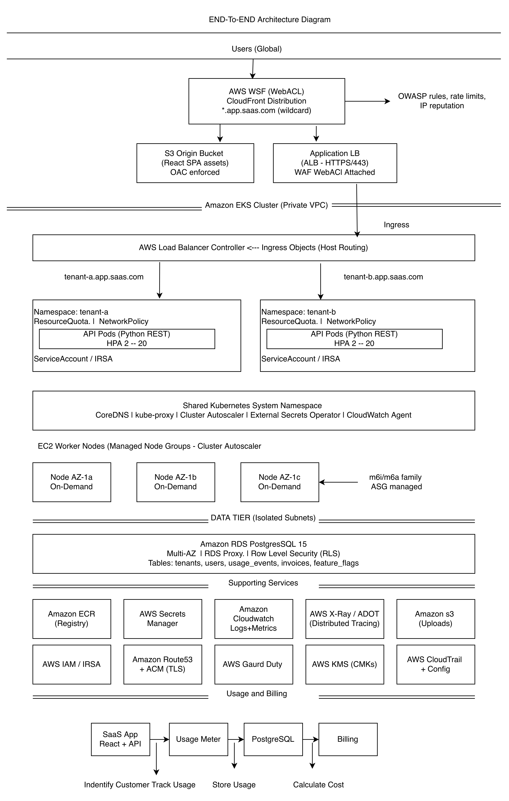
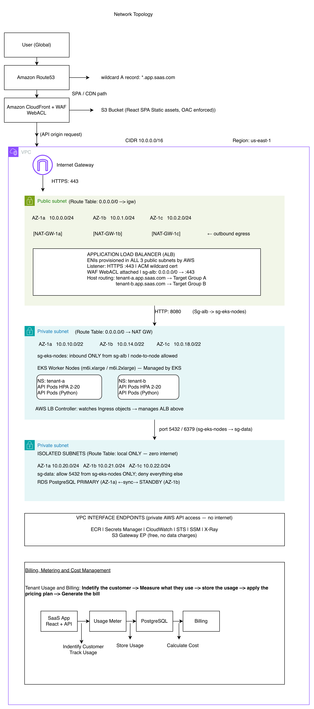

# SaaS Architecture Design

The architecture is divided into five horizontal tiers. Traffic enters through the Edge Tier, passes through the Gateway Tier, is processed in the Compute Tier (Amazon EKS), stored in the Data Tier, and monitored through the Observability Tier. All components run in a dedicated VPC across three Availability Zones.

Architecture Diagram -- End-to-End Flow:

## Network Topology

1. Architecture Explanation:
    - Traffic Entry:
      - `Route 53` - DNS Service Translates `tenant-a.app.saas.com` into an IP address so the browser knows where to go.
      - `CloudFront` - Global content delivery network. Serves the React app from a server closest to the user so it loads fast.
      - `AWS WAF` - Security filter. Blocks bad requests (SQL Injection, bots, suspicious IPs) before they reach the app.
      - `Internet Gateway` - The door between the internet and VPC. All inbound/outbound internet traffic passes through it.
    - Frontend:
      - `S3 (React SPA)` - File storage for build react app (HTML,JS,CSS files).CloudFront serves them from here.
    - Load Balancing:
      - `Application Load Balancer (ALB)` - Receives HTTPS requests and forwards then to the correct tenant's pods based on the subdomain (e.g. tenant-a  > tenant-a pods).
      - `NAT Gateway` -  Lets private servers reach the internet for outbound calls (e.g. pulling updates) without being reachable from the internet themselves.
    - Compute:
      - `Amazon EKS` - Managed kubernetes. Runs python API as Docker container and handles scheduling, health checks and restarts automatically.
      - `EKS Managed Node Groups` - The actual Ec2 virtual machines that runs containers. 
      - `Cluster Autoscaler` - Watches when pods are waiting for space and automatically adds more VMs. Removes VMs when they are no longer needed.
      - `HPA (Horizantal Pod Autoscaler)` - When CPU gets high, it adds more copies of Python PAI pods. When load drops its removes them.
      - `Kuberenetes Namespaces` -  Separate virtual environments inside the cluster - one per tenant, keeps tenant-a pods and data isolate from tenant-b's.
      - `AWS Load Balancer Controller` - Watches kubernetes config and automatically create/updates the ALB rules to match.
      - `Argo CD` - GitOps deployment tool. when developer push the code to Git, it automatically deploys the update to the cluster. No manual kubectl commands needed.
      - `OPA (Open Policy Agent)` — Policy enforcer inside Kubernetes. Blocks pods that violate rules (e.g. running as root, missing resource limits).
    - Container Registry:
      - `Amazon ECR` -  Private Docker image registry. Stores built Python and React container images. EKS pulls images from registry.
    - Database:
      - `RDS PostgresSQL` - The main relational database. Stores all application data. Multi-AZ allows a standby copy ready if the primary fails.
    - File Storage:
      - S3(Tenant Uploads) - Stores files uploaded by users (documents, images, exports). Each tenant's files are kept in separate prefixes.
    - Security & Identity:
      - `How the team access AWS` -  IAM Identity Center + SSO 
      - `How the application (pods) access AWS resource` - IRSA IAM role for service account.
      - `Encryption` - Data Protection — Encryption at Rest and in Transit, The rule is simple: data is always encrypted, whether it is moving or sitting still. No exceptions. 
        - ACM = encrypted tunnel for data travelling over the network. KMS = encrypted safe for data sitting on disk.
      - `AWS Secret Manager` - Secure vault for password and API keys. Pods fetch credentials from secret manager at runtime - nothing hardcoded
      - `GaurdDuty` - Threat detection, Continuously watches for unusual activity like cryptomining, data exfiltration or unusual API calls.
      - `Security Hub` - Single dashboard that collects security findings from GuardDuty, Inspector, and config in one place.
      - `CloudTrail` - Logs every action taken in AWS account (who did what and when). useful for audits and incident investigation.
      - `AWS Config` - Checks that AWS resource follow rules (e.g. no public s3 buckets, all disks encrypted). Alerts if something drifts.
      - `Amazon Inspector` - Scans Docker images and EC2 nodes for know security vulnerabilities automatically.
      - `Amazon Macie` - Scan s3 buckets and alerts if it finds sensitive data like credit card numbers or personal information that should not be there.
    - Billing, Metering and Cost Management:
      - AWS resource cost and `tenant usage` are two different things. example AWS EC2/EKS cost does not directly tell the cost of tenant-a and tenant-b.
        - The approach has two layers working together. The first layer is usage collection — the system continuously tracks what every tenant consumes (API calls, storage, compute, bandwidth) by injecting a lightweight middleware into the Python API and running background CronJobs. Each metric is tagged with tenant_id so it is always traceable to one specific tenant. The second layer is cost calculation — at the end of each billing period a Lambda function reads all usage data from RDS, applies the pricing tiers (free allowance, standard rate, overage rate), calculates the invoice per tenant, and triggers payment.
        - Compute (CPU/memory) - CloudWatch Container Insights per namespace → CronJob aggregates every 15 min
        - I would also use AWS tagging wherever possible.
    - Observability:
      - Every request should carry: `tenatn_id`, `request_id`, `trace_id` and `user_id`
        - `CloudWatch` - AWS's build-in monitoring. collects logs, metrics adn triggers alarms when something goes wrong.
        - `Fluent Bit` - Lightweight log collector running on every node. picks up pod logs and ship then to cloudwatch.
        - `ADOT/OpenTelemetry Collector` - Collects metrics and distributed traces from python API and send them to cloudwatch and X-Ray for performance monitoring.
        - `AWS X-Ray` - Shows the full journey fo a request through system. making it easy to find where slowdowns or error happen.
    - Scalability & High Availability:
      - Scalability — handling more tenants and more traffic:
        - The architecture scales on three independent levels simultaneously:
          - Pod level (fastest, seconds): HPA watches CPU usage per namespace. When tenant-a's API pods hit 70% CPU, it adds more pods automatically — up to 20 replicas. Each tenant scales independently without affecting others. 
          - Node level (minutes): When pods are waiting because there aren't enough VMs to schedule them, Cluster Autoscaler adds more EC2 nodes to the Auto Scaling Group. When load drops and nodes are idle for 10 minutes, it removes them to save cost. 
          - Database level: RDS Storage Auto Scaling grows the disk automatically when free space runs low. Read Replicas can be added to offload read-heavy queries. For enterprise tenants, a dedicated RDS instance is provisioned with its own Secrets Manager secret.
        Adding a new tenant requires zero infrastructure changes — a Kubernetes Job creates the namespace, applies the resource quotas, and registers the tenant in the database. The existing cluster absorbs it automatically.
2. VPC
    - The architecture is deployed in a dedicated VPC with three Availability Zones (AZs) for high availability and fault tolerance.
    - The VPC is divided into public and private subnets to separate external-facing components from internal services. 
   
    - VPC: 10.0.0.0/16 
      - A /16 gives 65,536 IP addresses. This is large enough to fit all tiers (public, private, and isolated) across 3 AZs, with enough room to grow without redesigning the network. 
      - The 10.x.x.x range is a private address space (RFC 1918) that does not conflict with public internet IPs, making it safe to use internally.
      
    - Public Subnets: /24 
      - A /24 gives 251 usable IPs, which is enough because only the ALB and NAT Gateway live here. Both use a small and predictable number of IPs. 
      - Keeping the public subnet small is intentional. Fewer available IPs make it harder to accidentally place a resource here and expose it to the internet. 
      
    - Private Subnets (Application): /22 
      - A /22 gives 1,019 usable IPs per AZ because the EKS VPC CNI assigns a real VPC IP address to every pod, not just to the nodes. One pod uses one IP address. With up to 20 nodes running 58 pods each, we need more than 1,000 IPs per AZ. 
      - A smaller block like /24, which has only 251 usable IPs, could be exhausted by just 4 fully loaded nodes. This could cause new pods to fail to start with an "no IP addresses available" error. 
      
    - Isolated Subnets (Data): /24 
      - A /24 gives 251 usable IPs, which is enough because the only things that live here are the RDS primary, RDS standby, RDS Proxy ENIs, and VPC Endpoint ENIs. Together, they use fewer than 30 IPs. 
      - Keeping it as a /24 follows the principle that the data tier should be small and tightly controlled. A large CIDR here could indicate that too many resources are being placed in a subnet meant mainly for databases.

